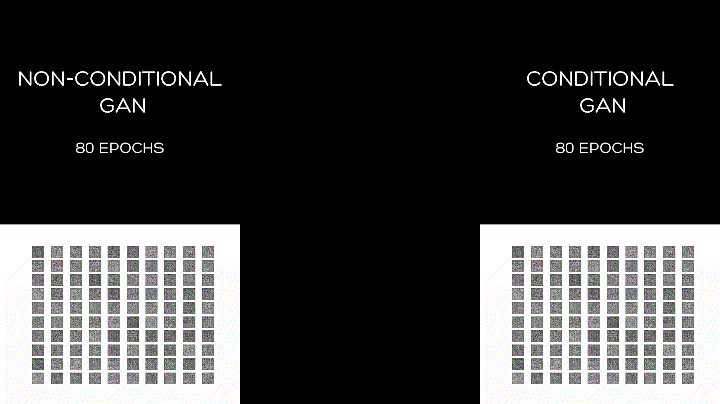

# Conditional GAN (cGAN) MNIST Fashion
A conditional GAN that learns to generate MNIST grayscale fashion images.

 

## Install

```
python -m venv env

.\env\Scripts\activate

pip install -r requirements.txt
```

## Architecture

```
python model.py
```

## Train

```
python main.py
```

## Run

```
python main.py --modelPath <path-to-model>
```

## Reference

https://machinelearningmastery.com/generative_adversarial_networks/
